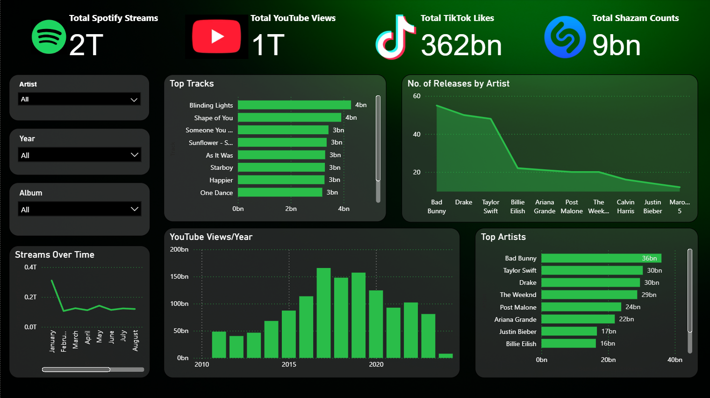

# 🎵 Spotify & Social Media Music Insights Dashboard  

## 📊 Overview  
This project analyzes the **most streamed Spotify songs (2024)** and their impact across **YouTube, TikTok, and Shazam**.  
The pipeline prepares clean data using Python and visualizes key insights with **Power BI**.  

---

## ⚙️ Data Preparation (main.py)  
- Loads raw dataset (`Most Streamed Spotify Songs 2024.csv`).  
- Keeps only relevant columns (Track, Artist, Album, Release Date, Streams, Popularity, YouTube, TikTok, Shazam, Explicit).  
- Cleans column names and formats dates.  
- Handles missing values and removes duplicates.  
- Exports cleaned dataset as:  
  - `spotify_clean.csv`  
  - `spotify_clean.xlsx`  

---

## 📈 Power BI Dashboard Features  
The dashboard highlights:  

1. **Top 10 Tracks by Streams** – Horizontal bar chart.  
2. **Top Artists by Total Streams** – Column chart.  
3. **Distribution of Explicit vs Non-Explicit Tracks** – Donut chart.  
4. **Trend of Release Years** – Line chart.  
5. **Social Media Impact** (YouTube, TikTok, Shazam) – Stacked bar chart.  

Additional KPIs:  
- Total Spotify Streams  
- Total YouTube Views  
- Total TikTok Likes  
- Total Shazam Counts  

Interactive **filters** (Artist, Year, Album) make exploration easy.  

---

## 🚀 Getting Started  
1. Run preprocessing:  
   ```bash
   python main.py
   ```
2. Open `spotify_clean.xlsx` in Power BI.  
3. Recreate visuals using fields as described above.  

---

## 🖼️ Dashboard Preview  
  

---

## 🎯 Impact  
This dashboard provides **data-driven insights** into music performance and cross-platform popularity, enabling:  
- Tracking artist dominance.  
- Identifying viral tracks.  
- Understanding release-year trends.  
- Comparing platform reach (Spotify vs YouTube vs TikTok vs Shazam).  
